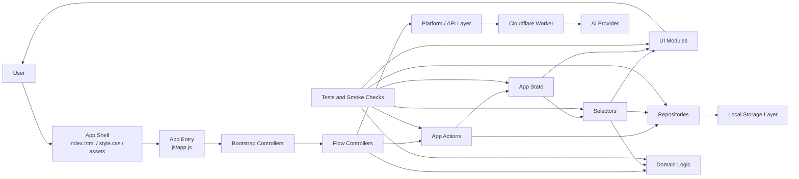

# Module Flows

This document reflects the current architecture after the move to:

- centralized runtime state
- action-driven state updates
- selector-based view models
- repository-based persistence

## 1. Module Interaction Diagram

## 2. Module Flow Diagram

```mermaid
flowchart TB
    subgraph Shell["App Shell"]
        ShellHTML["index.html"]
        ShellStyle["style.css and assets"]
        ShellAnchors["screen containers and modal anchors"]
        ShellHTML --> ShellAnchors
        ShellStyle --> ShellAnchors
    end

    subgraph Entry["App Entry"]
        AppEntry["js/app.js"]
        AppTurnstile["register Turnstile handlers"]
        AppUiBindings["bind shared UI callbacks"]
        AppBootstrap["bootstrap on DOMContentLoaded"]
        AppEntry --> AppTurnstile
        AppEntry --> AppUiBindings
        AppEntry --> AppBootstrap
    end

    subgraph Bootstrap["Bootstrap Controllers"]
        BootController["bootstrap-controller"]
        BootRuntime["bootstrap-runtime"]
        BootEvents["bootstrap-events"]
        BootController --> BootRuntime
        BootController --> BootEvents
    end

    subgraph Controllers["Flow Controllers"]
        AnalysisController["analysis-controller"]
        ProfileController["profile-controller"]
        RecordController["record-controller"]
        SharedController["controller-shared"]
        AnalysisController --> SharedController
        ProfileController --> SharedController
        RecordController --> SharedController
    end

    subgraph Actions["App Actions"]
        LangAction["set language"]
        ThemeAction["set theme"]
        DateAction["set selected date"]
        FoodAction["add or delete food"]
        FavoriteAction["add or delete favorite"]
        ProfileAction["apply profile plan"]
        AiDraftAction["set AI result and analysis flow"]
    end

    subgraph State["App State"]
        StateSnapshot["app-state snapshot"]
        StateSubscriptions["subscriptions"]
        DailyViewModel["daily state snapshot"]
        StateSnapshot --> StateSubscriptions
        StateSnapshot --> DailyViewModel
    end

    subgraph Selectors["Selectors"]
        DashboardSelector["dashboard view model"]
        PetSelector["pet coaching view model"]
        NutritionSelector["nutrition totals"]
        DashboardSelector --> NutritionSelector
        PetSelector --> NutritionSelector
    end

    subgraph Domain["Domain Logic"]
        NutritionDomain["nutrition-domain"]
        ProfileDomain["profile-domain"]
        AiDomain["ai-analysis-domain"]
        NutritionRules["calorie, macro, coach, streak logic"]
        ProfileRules["profile normalization and targets"]
        AiRules["AI result normalization and validation"]
        NutritionDomain --> NutritionRules
        ProfileDomain --> ProfileRules
        AiDomain --> AiRules
    end

    subgraph UI["UI Modules"]
        AppStateUI["app-state-ui"]
        DailySummaryUI["daily-summary-ui"]
        DashboardChartsUI["dashboard-charts-ui"]
        PetUI["pet-ui"]
        AnalysisUI["analysis-ui"]
        SettingsUI["settings-ui"]
        FavoritesUI["favorites-ui"]
        DetailUI["detail-ui"]
        ChartsUI["charts-ui integration layer"]
        AppStateUI --> ChartsUI
        AppStateUI --> AnalysisUI
        AppStateUI --> SettingsUI
        ChartsUI --> DailySummaryUI
        ChartsUI --> DashboardChartsUI
        ChartsUI --> PetUI
        ChartsUI --> FavoritesUI
        ChartsUI --> DetailUI
    end

    subgraph Locale["Locale and Copy"]
        LocaleCatalog["locale catalog"]
        LocaleIndex["locale resolver"]
        LocaleUi["locale-ui helpers"]
        LocaleCatalog --> LocaleIndex
        LocaleIndex --> LocaleUi
    end

    subgraph Repos["Repositories"]
        FoodRepo["food-log-repository"]
        WeightRepo["weight-repository"]
        ProfileRepo["profile-repository"]
        FavoritesRepo["favorites-repository"]
        SettingsRepo["settings-repository"]
        BackupRepo["backup-repository"]
        UsageRepo["usage-repository"]
    end

    subgraph Storage["Storage Layer"]
        StorageCore["storage.js"]
    end

    subgraph Platform["Platform and API"]
        PlatformModule["platform.js"]
        ApiModule["api.js"]
        EnvModule["env.js"]
        Diagnostics["diagnostics.js"]
        Utils["utils.js"]
        PlatformModule --> ApiModule
        EnvModule --> ApiModule
        Diagnostics --> ApiModule
        Utils --> ApiModule
    end

    subgraph Worker["Cloudflare Worker"]
        WorkerEntry["worker/index.js"]
        OriginGuard["origin and CORS guard"]
        TurnstileGuard["Turnstile verification"]
        Cooldown["cooldown and rate checks"]
        PromptBuild["request shaping"]
        ModelCall["AI provider call"]
        ErrorMap["error mapping"]
        WorkerEntry --> OriginGuard
        OriginGuard --> TurnstileGuard
        TurnstileGuard --> Cooldown
        Cooldown --> PromptBuild
        PromptBuild --> ModelCall
        ModelCall --> ErrorMap
    end

    subgraph Tests["Tests and Smoke Checks"]
        UnitTests["tests/*.test.mjs"]
        SmokeTests["scripts/browser-smoke.mjs"]
        UnitCoverage["domain, locale, state, selectors, storage"]
        SmokeCoverage["browser flows and render checks"]
        UnitTests --> UnitCoverage
        SmokeTests --> SmokeCoverage
    end

    ShellAnchors --> AppEntry
    AppBootstrap --> BootController
    BootEvents --> AnalysisController
    BootEvents --> ProfileController
    BootEvents --> RecordController

    AnalysisController --> AiDraftAction
    ProfileController --> ProfileAction
    RecordController --> FoodAction
    RecordController --> FavoriteAction
    BootEvents --> LangAction
    BootEvents --> ThemeAction
    BootEvents --> DateAction

    LangAction --> StateSnapshot
    ThemeAction --> StateSnapshot
    DateAction --> StateSnapshot
    FoodAction --> StateSnapshot
    FavoriteAction --> StateSnapshot
    ProfileAction --> StateSnapshot
    AiDraftAction --> StateSnapshot

    FoodAction --> FoodRepo
    FavoriteAction --> FavoritesRepo
    ProfileAction --> ProfileRepo
    LangAction --> SettingsRepo
    ThemeAction --> SettingsRepo
    DateAction --> FoodRepo
    DateAction --> WeightRepo
    AnalysisController --> UsageRepo
    BootEvents --> BackupRepo

    FoodRepo --> StorageCore
    WeightRepo --> StorageCore
    ProfileRepo --> StorageCore
    FavoritesRepo --> StorageCore
    SettingsRepo --> StorageCore
    BackupRepo --> StorageCore
    UsageRepo --> StorageCore

    StateSnapshot --> DashboardSelector
    StateSnapshot --> PetSelector
    StateSnapshot --> AppStateUI

    DashboardSelector --> DashboardChartsUI
    PetSelector --> PetUI
    DailyViewModel --> ChartsUI
    LocaleUi --> SettingsUI
    LocaleUi --> AnalysisUI
    LocaleUi --> DetailUI
    LocaleUi --> DailySummaryUI

    AnalysisController --> AiDomain
    ProfileController --> ProfileDomain
    RecordController --> NutritionDomain
    DashboardSelector --> NutritionDomain
    PetSelector --> NutritionDomain

    AnalysisController --> ApiModule
    ApiModule --> WorkerEntry
    ErrorMap --> ApiModule

    UnitCoverage --> Actions
    UnitCoverage --> State
    UnitCoverage --> Selectors
    UnitCoverage --> Domain
    UnitCoverage --> Repos
    SmokeCoverage --> UI
    SmokeCoverage --> Controllers
```

